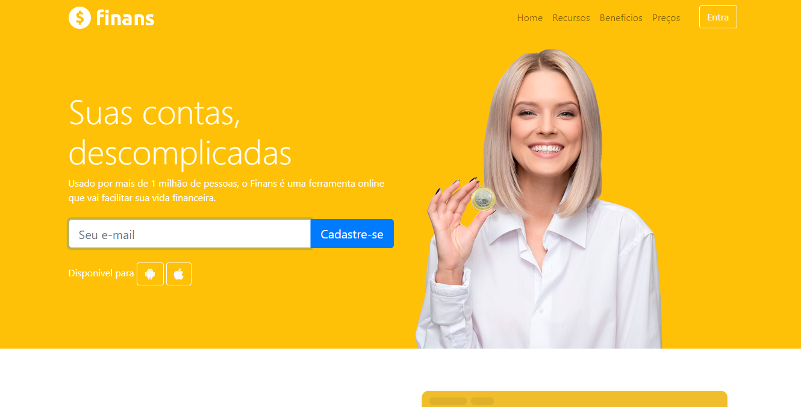

# projeto finans
<h1 align="center"> Site Finans </h1>

Projeto realizado no curso de Desenvolvimento web.

  <a href="#-tecnologias">Tecnologias</a>&nbsp;&nbsp;&nbsp;|&nbsp;&nbsp;&nbsp;
  <a href="#-projeto">Projeto</a>&nbsp;&nbsp;&nbsp;|&nbsp;&nbsp;&nbsp;
  <a href="#memo-licença">Licença</a>

  

 

  

/
## 🚀 Tecnologias

Esse projeto foi desenvolvido com as seguintes tecnologias:

- HTML e CSS
- Git e Github
- bootstrap

## 💻 Projeto

O projeto do Site finans tem como objetivo permite que voçê faça controles incriveis, essenciais para sua finançias.

## :memo: Licença

Esse projeto está sob a licença MIT.

---

Feito por israelamarante.
